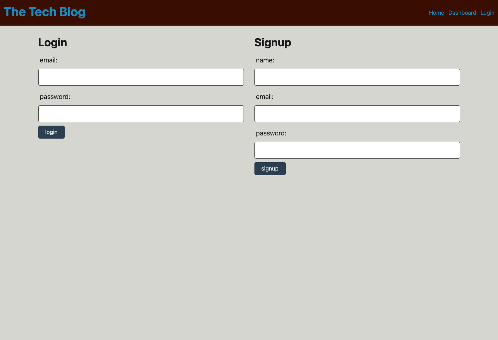

# MVC-Tech-Blog

## Description

A tech blog that allows users to create their own account and then post,update, and delete blog articles. Users can also post and delete comments on other users' posts. The application uses the Model-View-Controller paradigm and uses Handlebars.js as the templating language, Sequelize as the ORM, and the express-session npm package for authentication.

## Screenshot

## Link to Deployed Application

[Click Here](https://agile-thicket-19861.herokuapp.com/)